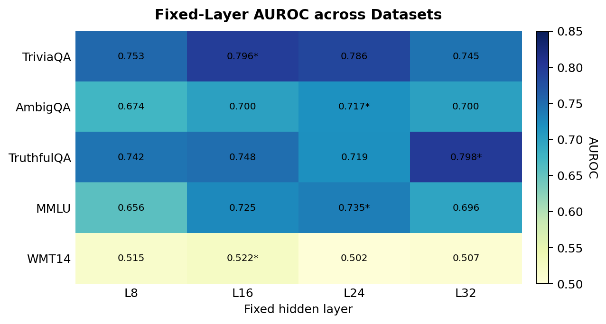

# DiagUQ

**Diagnostic Uncertainty Quantification from Multi-Layer Internal Activations of Large Language Models**

DiagUQ is a research codebase for studying *where* a large language model's
uncertainty comes from, not only *how much* uncertainty it has. Given a
prompt and a generated answer, DiagUQ reads the model's full stack of
internal hidden states, learns an adaptive layer-aware representation, and
predicts both an overall calibrated correctness score and a small set of
interpretable diagnostic dimensions (input ambiguity, parametric knowledge
gap, predictive variability). The repository contains everything required
to construct the supervision signals, train the diagnostic model, run the
ablations, and export per-sample artefacts for further analysis.

## Why this repository

Most supervised uncertainty estimators for LLMs reduce to two design
choices that are rarely revisited: a small number of hand-picked hidden
layers as the input feature, and a single scalar correctness score as the
output. Both choices limit what the resulting estimator can say.

- A scalar score can rank or threshold outputs, but it cannot tell a
  reader *why* a given answer is uncertain — whether the question itself
  is ambiguous, whether the model never learned the relevant fact, or
  whether sampling is unstable around an otherwise confident mode.
- A fixed-layer feature assumes that the same depth is informative across
  datasets, model families, and tasks, which empirically does not hold.

DiagUQ is built around these two limitations. It treats layer selection
as a learned, dataset- and model-conditional quantity, and it treats
uncertainty as a low-dimensional diagnostic profile rather than a single
opaque number. The overall calibrated score is preserved so the estimator
remains directly comparable to standard UQ baselines.

## Method overview

DiagUQ is a single small network with three components:

1. **Multi-layer internal representation.** The model ingests the full set
   of candidate transformer layers and learns soft attention weights over
   them, separately for the question-side and answer-side hidden states.
   Layer importance becomes a learned, instance-aware quantity instead of
   a fixed hyperparameter.
2. **Diagnostic dimensions.** On top of the fused representation, dedicated
   heads predict three complementary uncertainty dimensions:
   - *input ambiguity* — does the prompt itself admit multiple valid
     answers?
   - *parametric knowledge gap* — does the model lack the underlying
     factual knowledge?
   - *predictive variability* — how stable is the model's distribution
     over plausible continuations?
   Each dimension is supervised by a target derived from existing,
   well-defined signals (semantic entropy of sampled answers, ROUGE/BLEU
   correctness against references, sample-level diversity).
3. **Calibrated overall aggregation.** A small aggregator head combines
   the diagnostic dimensions into a single calibrated correctness
   probability, trained jointly with the per-dimension heads. This keeps
   DiagUQ directly comparable to scalar UQ baselines while preserving the
   per-dimension outputs for analysis and ablations.

### Why a single score is not enough

A scalar confidence score is sufficient for ranking and selective
prediction, but it conflates qualitatively different sources of error
under one number. DiagUQ keeps the scalar — so all standard ranking and
calibration metrics still apply — and additionally exposes a per-sample
diagnostic profile, so practitioners can inspect *which* component of
uncertainty drives a given prediction. This is the property the
ablations and per-sample exports in this repository are designed to
study.


## Results

DiagUQ surpasses all baseline methods on all datasets, indicating that leveraging internal hidden-state features via supervised diagnostic modeling results in more stable performance compared to relying solely on output probabilities, entropy, or ask4conf.

<div align="center">

| Dataset    | DiagUQ AUROC | Ask4Conf AUROC | Entropy AUROC | MaxProb AUROC |
| :----------: | :-----------: | :-------------: | :------------: | :------------: |
| TriviaQA   |    **0.840** |          0.817 |         0.549 |         0.453 |
| AmbigQA    |    **0.785** |          0.723 |         0.510 |         0.483 |
| TruthfulQA |    **0.655** |          0.647 |         0.559 |         0.462 |
| MMLU       |    **0.763** |          0.669 |         0.449 |         0.486 |
| WMT        |    **0.602** |          0.523 |         0.527 |         0.500 |

</div>

Layer-ablation results support the main design choice in DiagUQ: uncertainty
signals are not concentrated in one universally optimal hidden layer, and
simple multi-layer baselines do not match adaptive fusion.



The best fixed layer changes across datasets, ranging from layer 16 to
layer 32. This makes a single hand-picked hidden layer a brittle design
choice for cross-task uncertainty estimation.

<div align="center">

| Dataset | Best fixed layer |
| :---: | :---: |
| TriviaQA | 16 |
| AmbigQA | 24 |
| TruthfulQA | 32 |
| MMLU | 24 |
| WMT14 | 16 |

</div>

Across the five evaluated datasets, DiagUQ improves both ranking quality
and calibration over fixed-layer and simple multi-layer alternatives.

<div align="center">

| Method | Avg AUROC ↑ | Avg ECE ↓ | Avg Brier ↓ |
| :---: | :---: | :---: | :---: |
| DiagUQ | **0.749** | **0.081** | **0.190** |
| Selected fixed layer | 0.697 | 0.259 | 0.261 |
| Uniform layer mean | 0.679 | 0.262 | 0.271 |
| Fixed layer concat | 0.618 | 0.300 | 0.299 |

</div>

DiagUQ improves average AUROC by +0.052 over the selected fixed-layer
baseline while reducing average ECE by 0.177 and Brier score by 0.071.
Paired bootstrap tests further show that DiagUQ significantly outperforms
uniform multi-layer averaging and fixed multi-layer concatenation on AUROC
for all five datasets.

<div align="center">

| Comparison | Avg Δ AUROC ↑ | Significant AUROC gains |
| :--- | :---: | :---: |
| DiagUQ vs. uniform layer mean | +0.069 | 5/5 datasets |
| DiagUQ vs. fixed layer concat | +0.131 | 5/5 datasets |

</div>


## Installation

DiagUQ targets Python 3.12, CUDA 12.8, and PyTorch 2.8.0.

```bash
conda env create -f environment.yaml
conda activate diaguq
bash scripts/install_torch_cu128.sh
```

Set a Hugging Face token before downloading gated models:

```bash
export HF_TOKEN=hf_xxx
```

## Quickstart

```bash
python run.py setup-data
python run.py setup-models --include-reference-models

python run.py build-response-cache --scope custom -d triviaqa -m Llama-3.1-8B-Instruct
python run.py build-hidden-bank --scope custom -d triviaqa -m Llama-3.1-8B-Instruct
python run.py build-diagnostic-targets --scope custom -d triviaqa -m Llama-3.1-8B-Instruct
python run.py train-diaguq --scope custom -d triviaqa -m Llama-3.1-8B-Instruct
python run.py evaluate-diaguq --scope custom -d triviaqa -m Llama-3.1-8B-Instruct
python run.py export-analysis --scope custom -d triviaqa -m Llama-3.1-8B-Instruct
```

Use `--scope all` to run the registered experiment grid. Run `python run.py --help` for the full command list.

## Artifacts

Large runtime artifacts can be redirected with `DIAGUQ_RUNTIME_ROOT`. In local mode, generated files are written under `artifacts/`:

```text
artifacts/
  data/       # downloaded datasets
  models/     # downloaded model weights
  pipeline/   # response caches, hidden banks, targets, checkpoints, eval dumps
  cache/      # formatter and working caches
  results/    # small experiment summaries, plots, and exported tables
```

`DIAGUQ_ANALYSIS_ROOT` can override the default `artifacts/results` location.

## Project Layout

```text
run.py          # CLI entry point
environment.yaml
scripts/        # installation helpers
registry/       # dataset, model, and reference-model registries
data/           # dataset downloaders and formatters
features/       # response cache, hidden-state banks, feature tensors
pipeline/       # DiagUQ model, targets, training, and evaluation
analysis/       # per-sample export utilities
baseline/       # random-forest comparison baseline
common/         # shared artifact, calibration, path, and validation utilities
artifacts/      # local runtime artifacts and experiment results
```

## Baseline

The repository includes a random-forest supervised uncertainty baseline for controlled comparison:

```bash
python run.py baseline-setup-data
python run.py baseline-setup-models
python run.py baseline-build-features
python run.py baseline-train
python run.py baseline-evaluate
```
